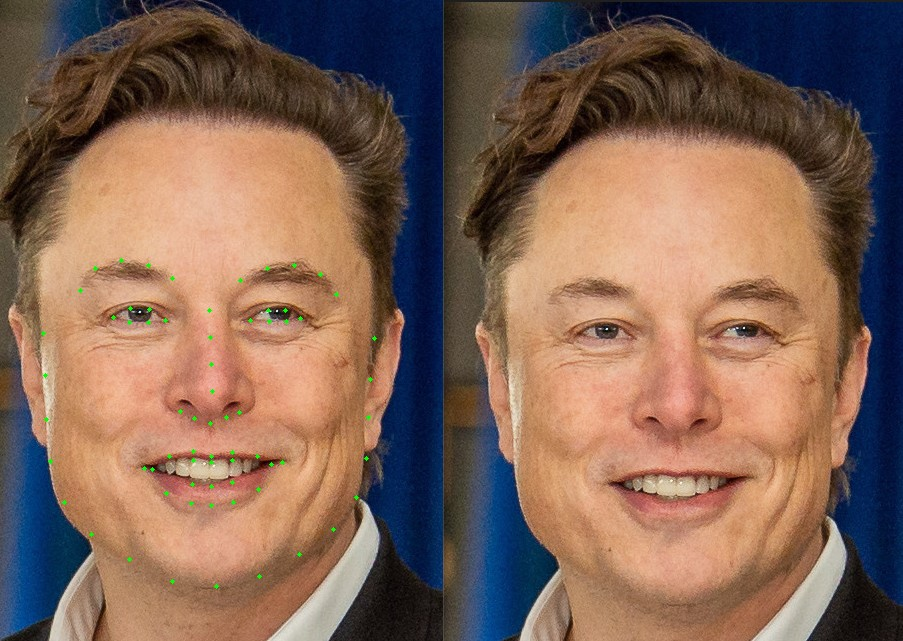
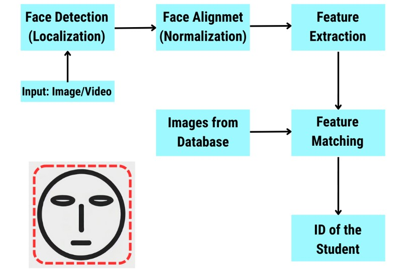

In the context of face recognition and processing,`landmarks` refer to specific, predefined points on a face that correspond to key facial features. These landmarks are used to capture the geometry of the face and can be crucial for tasks such as alignment, expression analysis, and feature extraction.

The **`dlib`** library is widely used for facial landmark detection. It provides a method to locate and map these landmarks on faces within an image.

### What are Facial Landmarks?

Facial landmarks typically include points around the:
- Eyes
- Eyebrows
- Nose
- Mouth
- Jawline

These points help in understanding the position and shape of these features, which is useful for various computer vision tasks.

<div align="center">
    <a></a>
</div>

### Facial Landmark Points

The 68 facial landmarks detected by `dlib` correspond to:
- 17 points for the jawline
- 10 points for the eyebrows (5 each)
- 9 points for the nose
- 12 points for the eyes (6 each)
- 20 points for the mouth

These points provide a detailed map of the face's geometry, useful for numerous facial analysis applications.


***
***

### Face Recognition System Development  :
<div align="center">
    <a></a>
</div>

***
***

This code is for a face recognition-based attendance management system. It utilizes the `face_recognition` library to recognize faces in a video stream and mark attendance in a CSV file. Here's a step-by-step explanation of the code:

### Imports and Initialization

```python
import face_recognition
import os, sys
import cv2
import numpy as np
import math
import csv
from datetime import datetime
```
These libraries are imported for various functionalities:
- `face_recognition` for face detection and recognition.
- `os` and `sys` for file operations and system functions.
- `cv2` for video capture and processing using OpenCV.
- `numpy` for numerical operations.
- `math` for mathematical operations.
- `csv` for handling CSV files.
- `datetime` for date and time operations.

### Attendance File Initialization

```python
attendance_file = 'attendance.csv'
f = open(attendance_file, 'w+', newline='')
lnwriter = csv.writer(f)
```
This creates or opens an attendance file named `attendance.csv` and prepares it for writing.

### Mark Attendance Function

```python
def mark_attendance(name):
    with open(attendance_file, 'r+') as f:
        lines = f.readlines()
        attendance_list = [line.split(',')[0] for line in lines]
        if name not in attendance_list:
            now = datetime.now()
            dt_string = now.strftime('%Y-%m-%d %H:%M:%S')
            f.write(f'{name},{dt_string}\n')
```
This function checks if a person's name is already recorded in the attendance file. If not, it records the name with the current date and time.

### Face Confidence Calculation

```python
def face_confidence(face_distance, face_match_threshold=0.6):
    range = (1.0 - face_match_threshold)
    linear_val = (1.0 - face_distance) / (range * 2.0)
    
    if face_distance > face_match_threshold:
        return str(round(linear_val * 100, 2)) + '%'
    else:
        value = (linear_val + ((1.0 - linear_val) * math.pow((linear_val - 0.5) * 2, 0.2))) * 100
        return str(round(value, 2)) + '%'
```
This function calculates the confidence level of the face match based on the face distance. If the distance is within the threshold, a higher confidence percentage is calculated.

### FaceRecognition Class

```python
class FaceRecognition:
    face_locations = []
    face_encodings = []
    face_names = []
    known_face_encodings = []
    known_face_names = []
    process_current_Frame = True
```
This class handles the face recognition process. It initializes lists to store face locations, encodings, names, and known face data.

#### Initialization and Encoding Faces

```python
def __init__(self):
    self.encode_faces()

def encode_faces(self):
    for image in os.listdir('faces'):
        face_image = face_recognition.load_image_file(f'faces/{image}')
        face_encoding = face_recognition.face_encodings(face_image)[0]
        self.known_face_encodings.append(face_encoding)
        self.known_face_names.append(os.path.splitext(image)[0])  # Store the image name without extension
    print(self.known_face_names)
```
The `__init__` method calls the `encode_faces` method, which loads face images from the 'faces' directory, encodes them, and stores the encodings and names.

#### Running Face Recognition

```python
def run_recognition(self):
    video_capture = cv2.VideoCapture(r'Attendance Management System Using Face Recognition.mp4')
    if not video_capture.isOpened():
        sys.exit('Video source not found...')
```
This method captures video from a specified file. If the video source is not found, it exits.

```python
    frame_width = int(video_capture.get(cv2.CAP_PROP_FRAME_WIDTH))
    frame_height = int(video_capture.get(cv2.CAP_PROP_FRAME_HEIGHT))
    fps = video_capture.get(cv2.CAP_PROP_FPS)
    output_filename = 'output.mp4'
    fourcc = cv2.VideoWriter_fourcc(*'mp4v')
    video_writer = cv2.VideoWriter(output_filename, fourcc, fps, (frame_width, frame_height))
```
It retrieves the frame dimensions and frames per second (fps) of the video and initializes a `VideoWriter` to save the output.

#### Processing Frames

```python
    while True:
        ret, frame = video_capture.read()
        if self.process_current_Frame:
            small_frame = cv2.resize(frame, (0, 0), fx=0.25, fy=0.25)
            rgb_small_frame = small_frame[:, :, ::-1]
            self.face_locations = face_recognition.face_locations(rgb_small_frame)
            self.face_encodings = face_recognition.face_encodings(rgb_small_frame, self.face_locations)
            self.face_names = []
            for face_encoding in self.face_encodings:
                matches = face_recognition.compare_faces(self.known_face_encodings, face_encoding)
                name = 'Unknown'
                confidence = 'Unknown'
                face_distances = face_recognition.face_distance(self.known_face_encodings, face_encoding)
                best_match_index = np.argmin(face_distances)
                if matches[best_match_index]:
                    name = self.known_face_names[best_match_index]
                    confidence = face_confidence(face_distances[best_match_index])
                self.face_names.append(f'{name}({confidence})')
                mark_attendance(name)
        self.process_current_Frame = not self.process_current_Frame
```
In each frame, it resizes the frame for faster processing, converts it to RGB, detects faces, and encodes them. It compares each detected face with known faces and calculates the confidence level. If a match is found, it marks the attendance.

#### Annotating and Displaying Frames

```python
        for (top, right, bottom, left), name in zip(self.face_locations, self.face_names):
            top *= 4
            right *= 4
            bottom *= 4
            left *= 4
            cv2.rectangle(frame, (left, top), (right, bottom), (0, 0, 255), 2)
            cv2.rectangle(frame, (left, bottom - 35), (right, bottom), (0, 0, 255), -1)
            cv2.putText(frame, name, (left + 6, bottom - 6), cv2.FONT_HERSHEY_DUPLEX, 0.8, (255, 255, 255), 1)
        video_writer.write(frame)
        cv2.imshow('Face Recognition', frame)
        if cv2.waitKey(1) == ord('q'):
            break
    video_capture.release()
    video_writer.release()
    cv2.destroyAllWindows()
```
It draws rectangles around detected faces and labels them with names and confidence levels. The annotated frames are saved to an output video file and displayed in a window. The loop continues until the 'q' key is pressed.

### Main Function

```python
if __name__ == '__main__':
    fr = FaceRecognition()
    fr.run_recognition()
```
This creates an instance of the `FaceRecognition` class and runs the recognition process.

