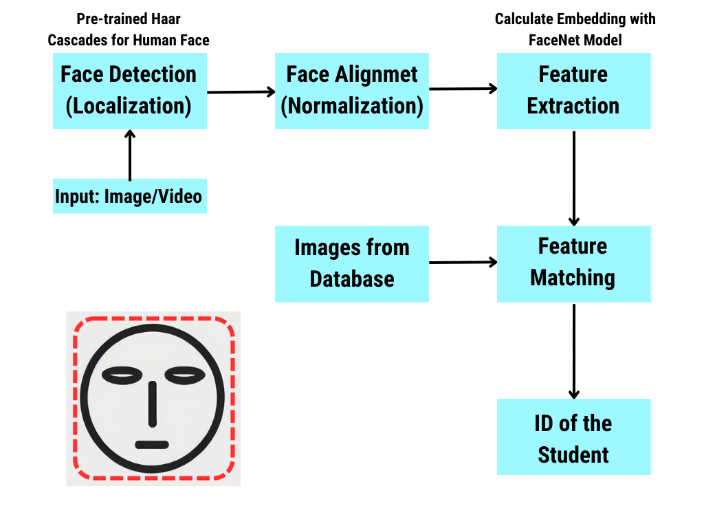

In the context of face recognition and processing,`landmarks` refer to specific, predefined points on a face that correspond to key facial features. These landmarks are used to capture the geometry of the face and can be crucial for tasks such as alignment, expression analysis, and feature extraction.

The **`dlib`** library is widely used for facial landmark detection. It provides a method to locate and map these landmarks on faces within an image.

### What are Facial Landmarks?

Facial landmarks typically include points around the:
- Eyes
- Eyebrows
- Nose
- Mouth
- Jawline

These points help in understanding the position and shape of these features, which is useful for various computer vision tasks.

    

### Facial Landmark Points

The 68 facial landmarks detected by `dlib` correspond to:
- 17 points for the jawline
- 10 points for the eyebrows (5 each)
- 9 points for the nose
- 12 points for the eyes (6 each)
- 20 points for the mouth

These points provide a detailed map of the face's geometry, useful for numerous facial analysis applications.

***
***

    

***
***

